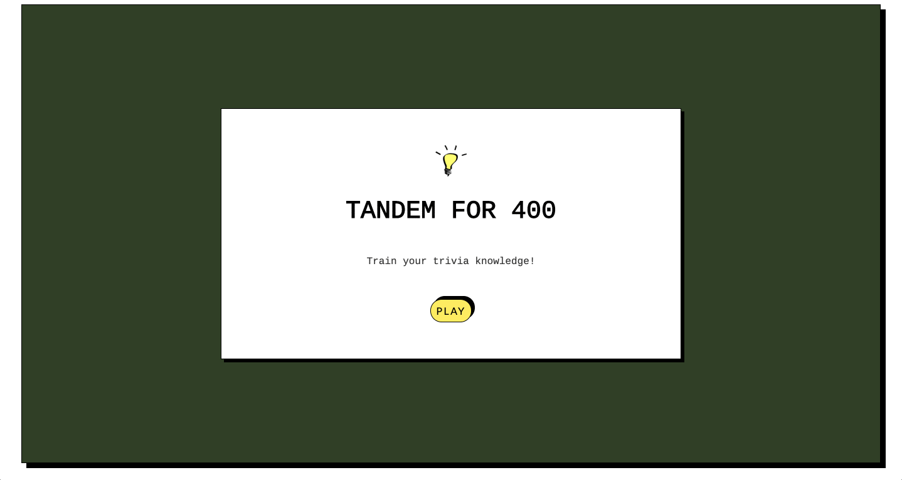
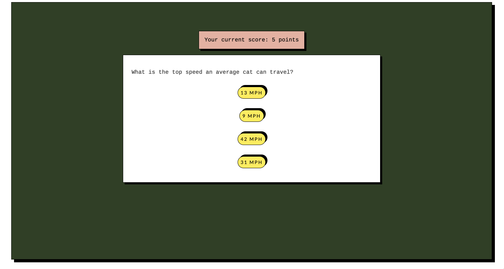
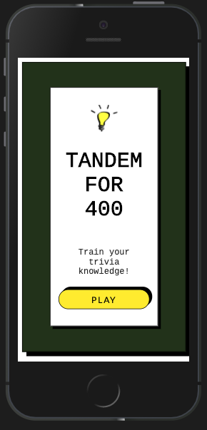
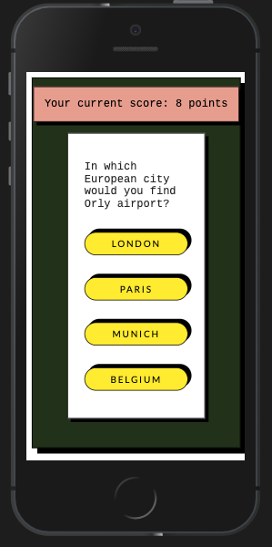
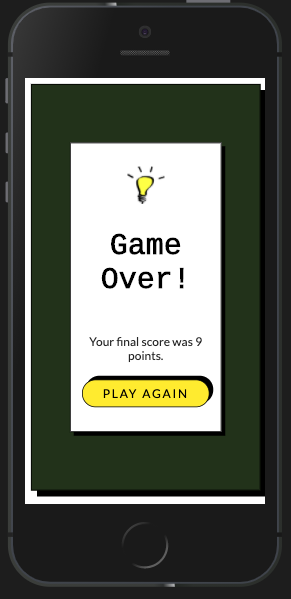

# Tandem for 400
This is the code challenge for Tandem's Software Engineer Apprentice application. It is a trivia game, built with a provided set of questions. I tried to keep the UI simple and used a palette with colors from Tandem's website. The app is fully responsive and accessible (with 100% accessibility audit from Lighthouse). 

## To View
- Deployed link: https://tandem-for-400.herokuapp.com/
  - The deployed link can be slow to "wake up" and load
- Local Setup:
  - Clone down the repository using `git clone git@github.com:lilianaweimer/tandem-for-400.git` in your terminal
  - Use `cd tandem-for-400` to move into the project directory
  - Run `npm install` in your terminal to install dependencies
  - Run `npm start` in your terminal to start the local server
  - View at http://localhost:3000 in your browser
  - Type `^c + enter` (`control + c` -- on Mac) in your terminal to terminate local server when done

## In action

Starting the game:

Ending the game and starting a new round:

Mobile Layout:

  

## Goal
The goal of the project per the challenge prompt, is:

Your goal is to create an application that displays trivia questions with multiple-choice answers to select from.

Use creative license in terms of how you want us to see this game. At minimum, the player can view the question(s), the answer choices, the correct answer upon submission, and their score. It could be a user interface (UI), command-line-tool, etc. Feel free to use whatever framework or language you are comfortable with.

We would also like to see a README which includes any information about how to run the code, any known issues or complexity we should look out for, and any additional features you would like to have added to make your trivia app even more awesome.

More details about the project description [here](#Additional-Details-from-Challenge-Description).

## Tech Stack
- React (with Hooks)
- React Router
- SCSS
- React Testing Library
- Jest

I have elected to keep the tech stack relatively simple, because the challenge description states: "use as few external dependencies as possible to keep the setup simple."

## Future Iterations
- Store the scores in `localStorage` and have a leaderboard
- Deploy the backend
- Add an option to add questions
- User authentication

## Known Issues
- There is a warning coming from some tests: `Error: Not implemented: navigation (except hash changes)`. I am unsure of what is causing it.
- The data is currently "fetched" with a mock API call. This is so that turning it into an actual API call in the future will break as few things as possible, but it is a little strange as is.

## Additional Details from Challenge Description
### Assumptions
- A round of trivia has 10 Questions
- All questions are multiple-choice questions
- Your score does not need to update in real time
- Results can update on form submit, button click, or any interaction you choose
- We will provide you with the trivia data such as the questions, correct and incorrect answers via a JSON file.

### Acceptance Criteria
- A user can view questions.
- Questions with their multiple choice options must be displayed one at a time. 
- Questions should not repeat in a round.
- A user can select only 1 answer out of the 4 possible answers.
- The correct answer must be revealed after a user has submitted their answer 
- A user can see the score they received at the end of the round

### Additional considerations
Tandem's first core value is "Ship Quality Work." We love unit tests and automated test coverage in our projects. Well-tested code provides documentation for other developers and prevents future regressions (bugs introduced after a change) among other things. If you would like a challenge, consider adding unit tests to display your commitment to quality code.

I *would* like a challenge :)

This project was bootstrapped with [Create React App](https://github.com/facebook/create-react-app).
